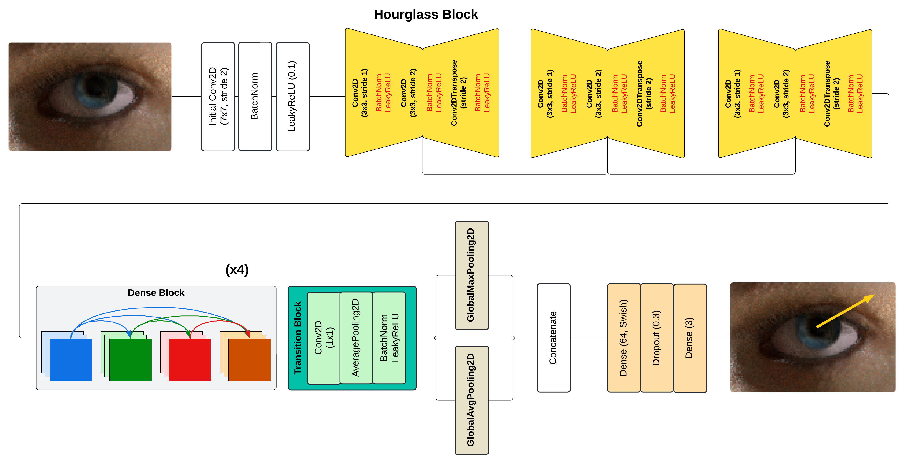

## Lightweight DPG for 3D Gaze Estimation

> A simplified implementation of the **Deep Pictorial Gaze (DPG)** model to estimate 3D gaze direction from RGB eye images.  
Combines DenseNet-inspired blocks with hourglass modules and dual pooling for spatial refinement.  

Live demo → **[https://gaze-estimation.streamlit.app](https://gaze-estimation.streamlit.app)**

---

## Built With

  
  
  

---

## Architecture

---
